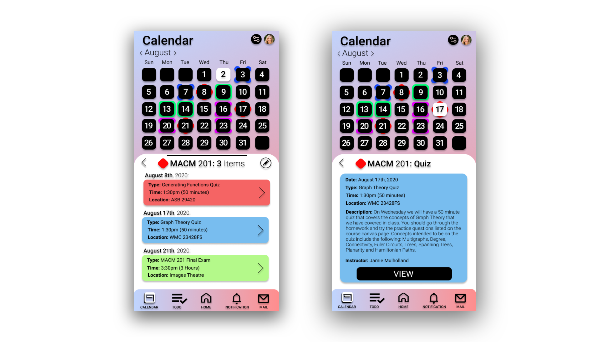
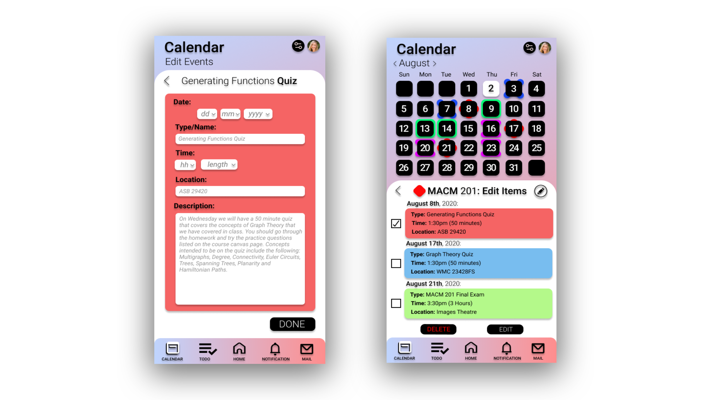
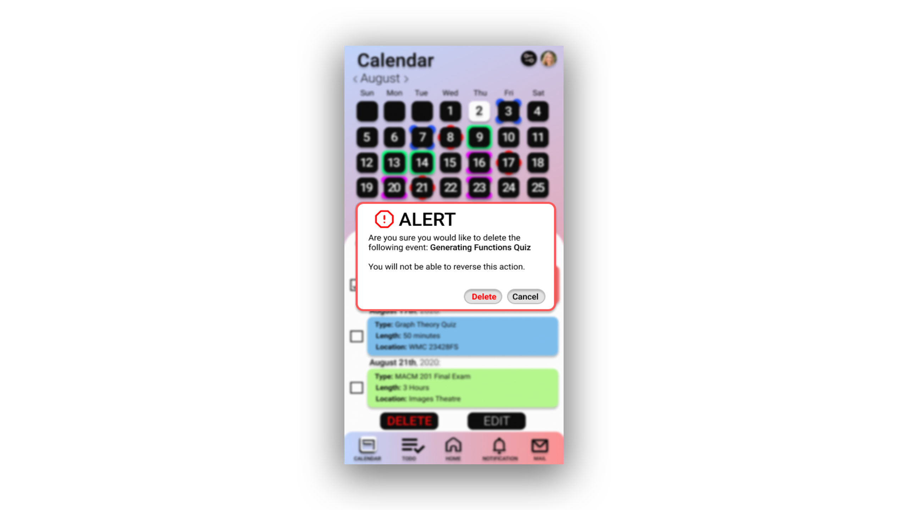

# CanvasUI
A thorough redesign of the calendar in the Canvas Mobile App having completed usability inspections, user research questions, black and white scenario-based storyboards, and mockups (usability, usefulness, and desirability). Figma was the primary tool used to create an interactive experience and Balsamiq for mockups and scenario-based storyboards.

